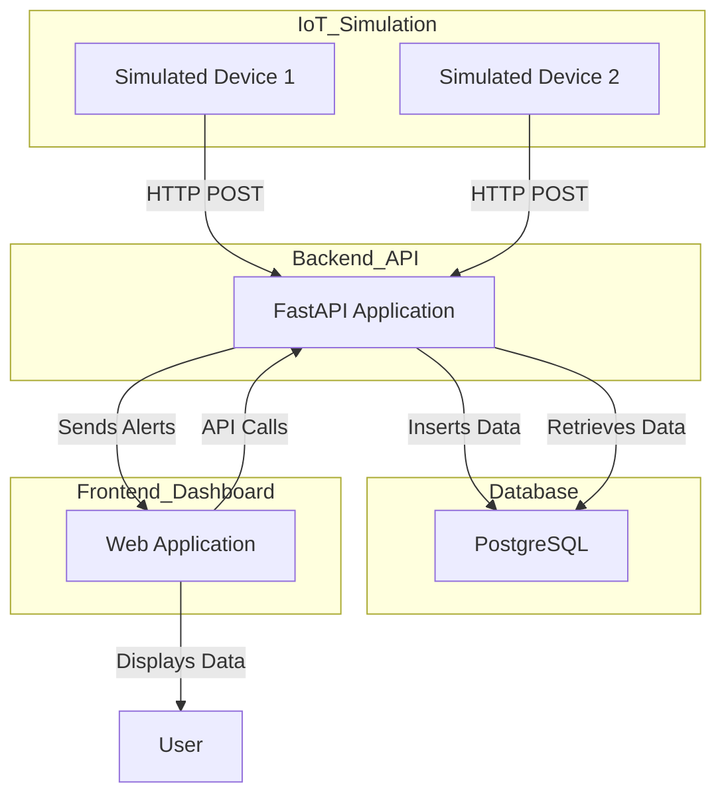

# Documentation Overview

This documentation provides all the necessary details for understanding the architecture and configuration of the IoT Simulator project.

## Table of Contents
- [Overview](#overview)
- [Project Documentation](#project-documentation)
- [Architecture Diagram](#architecture-diagram)

## Overview
The `/docs` folder contains all the documentation required to set up, run, and understand the IoT Simulator project. It includes an architectural overview, instructions on running the simulator, and details about the components involved.

## Project Documentation
This directory contains:
- **architecture-diagram.mermaid**: A Mermaid file that provides a visual representation of the architecture.
- **README.md**: This document, giving an overview and embedding the architecture diagram for easy reference.

## Architecture Diagram
The architecture of the IoT Simulator is represented in the `architecture-diagram.mermaid` file, which outlines the interactions between various components.

Below is the embedded architecture diagram:

To view the diagram, make sure you are using a Markdown viewer that supports Mermaid syntax or use an online tool to render the diagram for better visualization.

### Example Usage of Mermaid
You can use the Mermaid diagram to understand how different containers interact within the project, especially focusing on the independent nature of each device and their communication with the backend API.

To visualize the Mermaid diagram, you can:
- Use [Mermaid Live Editor](https://mermaid-js.github.io/mermaid-live-editor/) to paste the contents of `architecture-diagram.mermaid` and view the architecture in detail.

## Important Notes
- Keep the documentation updated as the project evolves.
- Ensure any new architecture changes are reflected in the `architecture-diagram.mermaid` file for consistency.

