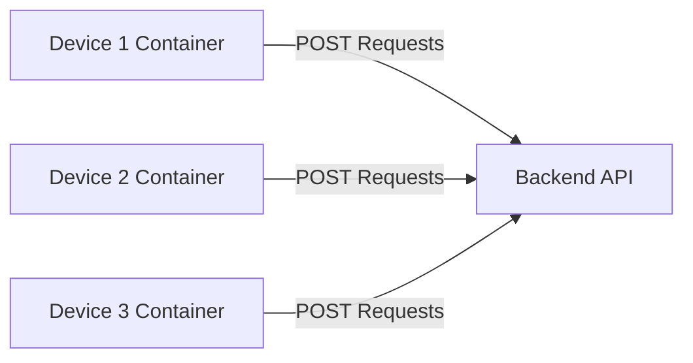

# IoT Simulator Project

This project simulates IoT devices that send waste compactor fullness levels to a backend API at regular intervals. The IoT simulator can simulate multiple devices running as independent containers, each of which posts data to the API.

## Table of Contents
- [Overview](#overview)
- [Project Structure](#project-structure)
- [Requirements](#requirements)
- [Installation](#installation)
- [Configuration](#configuration)
- [Running the Simulator](#running-the-simulator)
- [Docker Deployment](#docker-deployment)
- [Logging](#logging)
- [Simulation Details](#simulation-details)

## Overview
The simulator project emulates IoT devices that track the fullness of waste compactors. Each device container uses a unique certificate and sends fullness data to the API every set interval. The fullness level is incremented over time to simulate the waste compacting process.

## Project Structure
```
|-- certs/
|   |-- device1_cert.pem
|   |-- device2_cert.pem
|   |-- device3_cert.pem
|
|-- devices_simulator/
|   |-- config.py
|   |-- utils.py
|   |-- device.py
|   |-- main.py
|
|-- Dockerfile
|-- docker-compose.yml
|-- .env
|-- README.md
```

- **config.py**: Handles loading environment variables and configuration parameters.
- **utils.py**: Contains utility functions for logging configuration.
- **device.py**: The core logic for simulating device behavior, including sending data to the API.
- **main.py**: Entry point to start the device simulation.

## Requirements
- Python 3.10 or newer
- Docker & Docker Compose
- `pip` package manager
- `requests` library for HTTP requests
- `python-dotenv` for environment variable management

## Installation
1. Clone the repository:
   ```bash
   git clone https://github.com/yourusername/iot-simulator.git
   cd iot-simulator
   ```

2. Create a virtual environment:
   ```bash
   python -m venv venv
   source venv/bin/activate  # On Windows use `venv\Scripts\activate`
   ```

3. Install required Python packages:
   ```bash
   pip install -r requirements.txt
   ```

## Configuration
1. Create a `.env` file in the root directory to define the environment variables used in the project.

   Example `.env` file:
   ```env
   API_URL=http://localhost:8000/readings/
   API_KEY=your_api_key_here
   POST_INTERVAL_SECONDS=60
   GROWTH_DURATION=600
   TIME_AT_FULL=300
   CERTIFICATE_PATH=/app/certs/device1_cert.pem
   FIRMWARE_VERSION=1.0.0
   ```

2. Update the **Docker Compose** file with the correct paths for your device certificates.

## Running the Simulator
To run a device simulator locally, use the following command:
```bash
python devices_simulator/main.py
```
This will start simulating a device, sending fullness level updates to the specified API endpoint at regular intervals.

## Docker Deployment
### Building the Docker Image
To build the Docker image for the simulator, run:
```bash
docker build -t iot-simulator:latest .
```

### Running with Docker Compose
The simulator can be run as multiple device containers using Docker Compose:
```bash
docker-compose up --build
```
This command will build and start multiple containers, each simulating a separate device.

### Deploying to a Remote Host
The `deploy_to_prod.sh` script allows deploying the containers to a remote Docker host.

## Logging
Logs are saved in `device.log` and contain information about each POST request, including:
- Timestamp of the reading
- Fullness level of the compactor
- Target API URL

Logs are also printed to the console for real-time monitoring.

## Simulation Details
### What the Simulator Does
The IoT simulator sends POST requests to the backend API with the following JSON payload:
```json
{
  "timestamp": "{{timestamp}}",
  "fullness_level": {{fullness_level}}
}
```
Each request includes an `X-Client-Cert` header, which is mandatory. The certificate is used to authenticate the device, allowing the backend to identify which device is sending the data.

In a real-world scenario, the certificate could be uploaded to the IoT device as part of the firmware, providing an additional layer of security and authentication.

### Simulation Algorithm
The fullness level of each device is simulated to increase over time, representing the compactor filling up with waste. The simulation algorithm follows these steps:
1. **Initial State**: The fullness level starts at `0` and the device is in the `increasing` state.
2. **Increasing State**: The fullness level gradually increases to `100` over the configured `GROWTH_DURATION` (e.g., 5 or 20 minutes).
3. **Full State**: Once the fullness level reaches `100`, the device enters the `full` state for the configured `TIME_AT_FULL` duration (e.g., 5 minutes).
4. **Resetting State**: After staying in the full state for the specified time, the fullness level is reset to `0` and the process starts over.

### Communication
The simulator uses **HTTP REST** to communicate with the backend. Each reading is sent as a **POST** request to the configured API URL (`API_URL`). This includes a timestamp and the current fullness level, along with the `X-Client-Cert` header for device authentication.

### Independent Containers for Each Device
Each IoT simulated device is deployed as a separate Docker container, which operates independently. This setup allows for scalable load testing and more realistic simulation of multiple devices. Each container can run independently, which helps in scaling the number of devices for different testing scenarios.



## Important Notes
- Make sure to **keep certificates secure**.
- Ensure the **correct configuration parameters** are set in the `.env` file to avoid any runtime errors.
- The project is configured to retry requests in case of network issues or API downtime.

